# Ultwa/the kindos

## Iteration 01 - Review & Retrospect

 * When: 13 February 2026 at 5:30 - 6:30 pm.
 * Where: Online

## Process - Reflection

In this document, we will be doing a short reflection on how our first sprint went. This encompasses all the major good and bad decisions we made and our future plans for the next sprints. One thing to note is that some features were implemented after the demo and before the sprint 1 deadline. The features that we talk about will be the ones before the demo as we are expected to make this document right after the demo.

#### Decisions that turned out well

List process-related (i.e. team organization) decisions that, in retrospect, turned out to be successful.

1. **Designing the prototype of the app using Figma before coding the website.**
   We decided to use Figma to design the frontend of the website before actually coding the website. This allowed us to align the frontend UI with the requirements given by the founder and test the user flow such as navigation and screen-to-screen flow to see if it's intuitive and matches the needs of the founder. Using Figma, these iterative refinements of the user-interface and user-flow were fast so we made changes to the layout, content and interacts with minimal cost until the ideal prototype was obtained.

   In retrospect, this decision was successful as our whole team agreed that the UI matches with the design of the existing ‘Ultwa’ website and we all thought that the user interface was easy and intuitive to use. Furthermore, our TA gave us a positive review of the frontend of the website during our demo. Additionally, using Figma to design the frontend made it easy for us to have a consistent layout when coding the website and allowed us to focus more on the backend functionality. Thus, we can conclude that our choice to perfect the design before actually coding was a success.

   Figma Link:  [https://www.figma.com/proto/VFYXoH5absLavMIRKG3mxk/Untitled?node-id=1-2\&p=f\&t=5nUZQcN0wcDQzJ9A-1\&scaling=min-zoom\&content-scaling=fixed\&page-id=0%3A1\&starting-point-node-id=1%3A2](https://www.figma.com/proto/VFYXoH5absLavMIRKG3mxk/Untitled?node-id=1-2&p=f&t=5nUZQcN0wcDQzJ9A-1&scaling=min-zoom&content-scaling=fixed&page-id=0%3A1&starting-point-node-id=1%3A2)

2. **Moved storing the documents from the backend folder to a Cloudflare** R2
   In the doctor registration, we have to upload documents for supporting documents that the doctor can upload to show verification that they are a professional doctor. This was initially stored in a folder in the backend but we decided to move it to using Cloudflare R2 which is a cloud storage to store the documents.

   Although this made file storage more complicated, it had many benefits which is why we would call this a successful decision. First, we were able to implement using Cloudflare R2 with minimal changes to the existing codebase so we were able to have the same functionality before and after the decision. Secondly but more importantly, this decision has a long term impact as we knew that to be able to deploy the website in the future that we would have to eventually do this. By doing this now, it ensures that the least amount of refactoring had to be done and that there were no problems in the implementation of using Cloudflare R2 before the project became too large. This could have had detrimental effects if we did it towards the end as it would have been much harder to integrate using the Cloudflare R2 storage and more issues and bugs would have arisen. Lastly, using this cloud storage our backend file structure is more clean as we are not storing documents in the backend.

   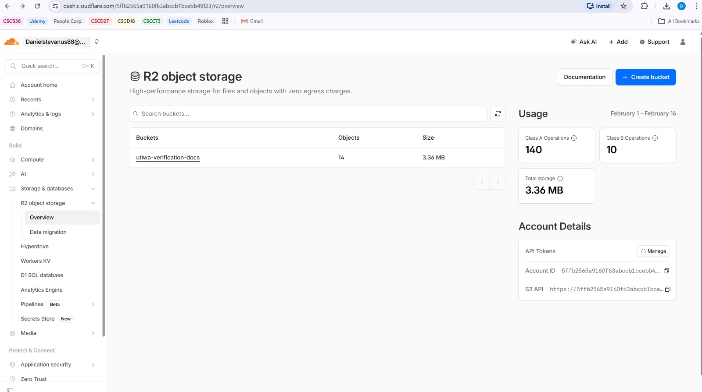

   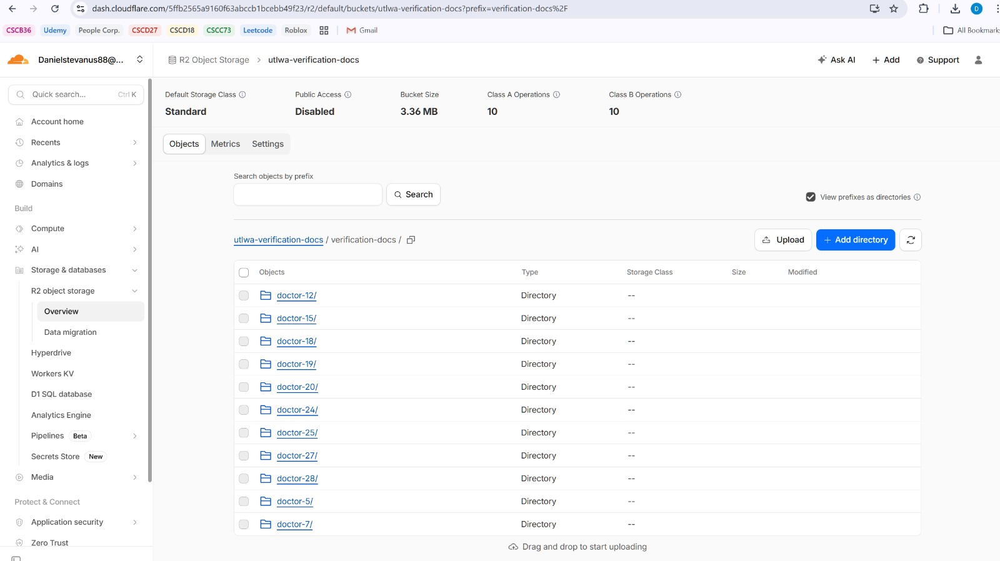

#### Decisions that did not turn out as well as we hoped

List process-related (i.e. team organization) decisions that, in retrospect, were not as successful as you thought thyaey would be.

1. **Migration files of database**
   We are using sequalize as our Object-Relational Mapping to the Postgresql database. We use sequalise.sync to allow the database to be synchronised if we made changes to the schema or if we wanted to add more tables. We chose this decision as we thought it was simple and it worked for our scenario. By this we mean that during testing, whenever we made changes to the schema or added more tables using sequalise.sync didn’t delete any of the previous data and seemed to have no issues. It just added the new fields that were modified in the schema.

   In retrospect, we realised that doing this was not safe for production in the future as sync() is not a versioned, auditable record of schema changes and its behaviour can vary depending on database state and configurations which may lead to unpredictable behaviours. This was then pointed out by our TA during the demo that this was dangerous and we needed specific migration files that allowed us to make modifications to the schema without affecting the data that was already stored in the database.

    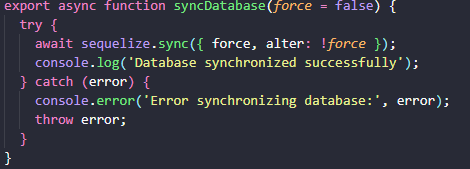

2. **Hashing of the passwords for user login**
   We knew that we had to set up some sort of hashing system for the user login details as we wanted to prevent passwords from being revealed. Therefore, we hashed the password in the backend using bcrypt like how we did it in lab 4. We thought that doing the hashing was only needed in the backend as it prevents the server from knowing the password of the user.

   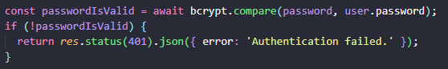

   We thought that this was enough hashing, but our TA pointed out how we had to also hash the password in the frontend before it was passed to the backend as this is a security flaw. Therefore, we considered our decision of only hashing in the backend to be unsuccessful due to the security flaws that present due to this implementation.

#### Planned changes

List any process-related changes you are planning to make (if there are any)

 * Ordered from most to least important.
 * Explain why you are making a change.

1. **Migration files**
   We need to make the migration files so that if changes to the schemas are made, it wouldn’t destroy the database which would be very expensive to fix and impactful when the website will be deployed in the future. These migration files would allow us to modify the schema and modify the tables based on the new schemas without dropping the previous tables so that the current data is stored in the database.

2. **Implement the hashing of user passwords correctly**
   We need to hash the passwords in the frontend before it goes to the backend to prevent the server from knowing the user’s details.

## Product - Review

#### Goals and/or tasks that were met/completed:
Note that these goals / tasks were the tasks that were finished before the demo (13th February) and not the deadline of sprint 1 (15th February).
 * From most to least important.
 * Refer/link to artifact(s) that show that a goal/task was met/completed.
 * If a goal/task was not part of the original iteration plan, please mention it.

1. **SCRUM-5** — *As a user, I would like to log in securely and reset my password…*

   This is the logging page for a user. There are 3 types of users which have the same login screen but the user just has to select the different type of user shown below. Note that since the login process is the same, I will only focus on the patient.

   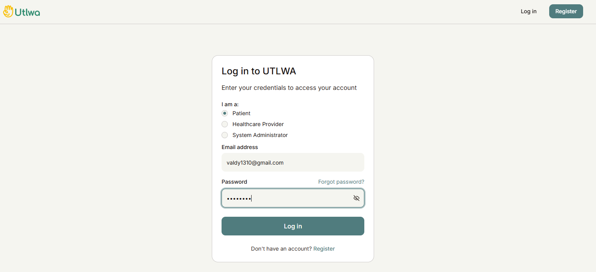

   After logging in, the patients dashboard will be as follows:

   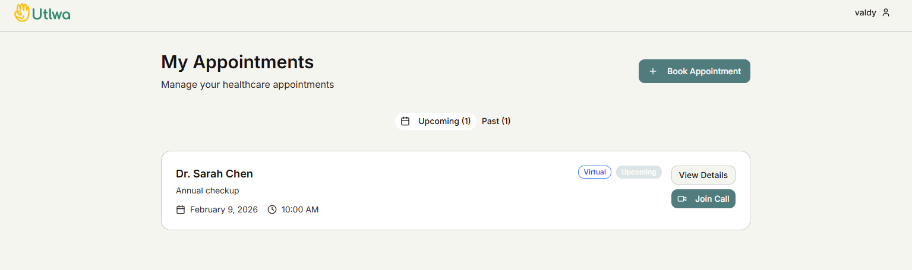

   If the user forgets their password, they can click on the oAfter clicking on the forgot password, the user is taken to a page that asks for the email.

   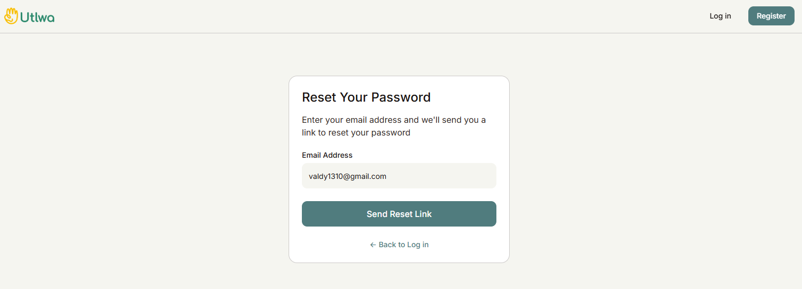

   Then an email will be sent like below:

   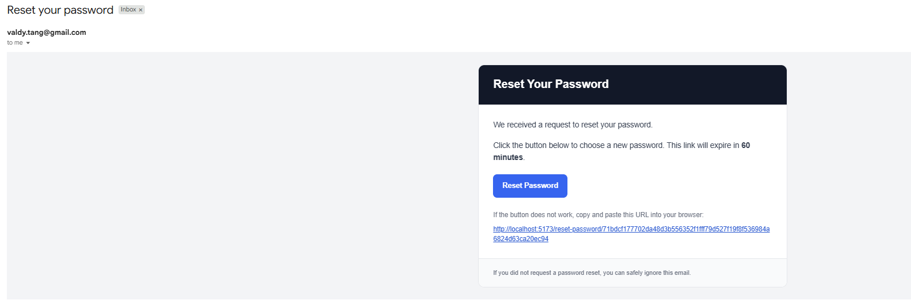

   After clicking the link to reset password, the user can enter their new details:

   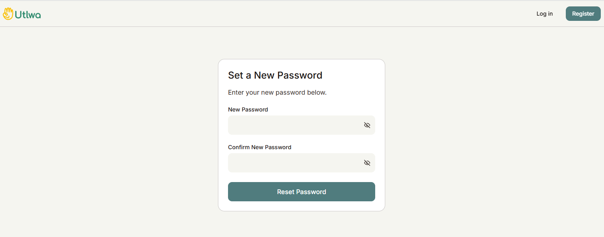

2. **SCRUM-6** — *As a patient, I would like to register an account with my details…*
   To register, just go to the register page and click on “Patient” option

   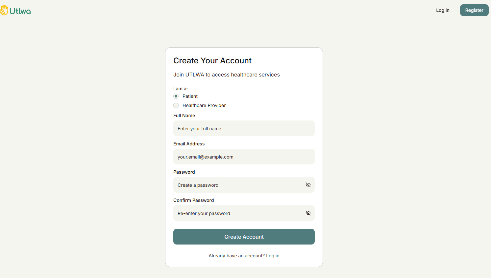

3. **SCRUM-18** — *As a doctor, I would like to register with professional details and submit for verification…*
   For a doctor to register, just go to the register page and click on the option “Healthcare provider”.

   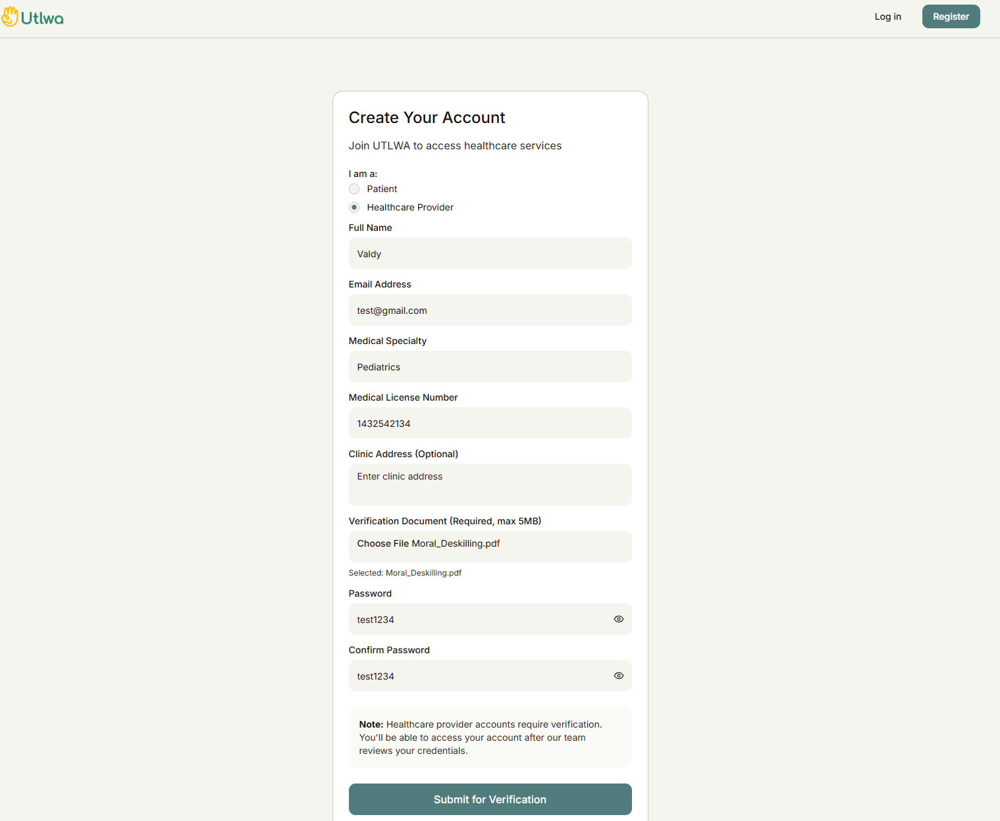

   After registering, it will require the system administrator to verify the doctor.

   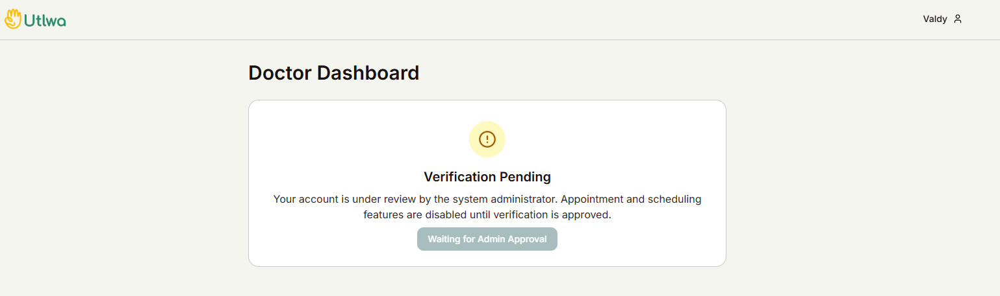

4. **SCRUM-27** — *As a system administrator, I would like to verify and approve doctor registrations…*
   Onced logged in as an admin, the admin is able to approve and deny the doctors by clicking on the buttons on the right side of each doctor profile.

  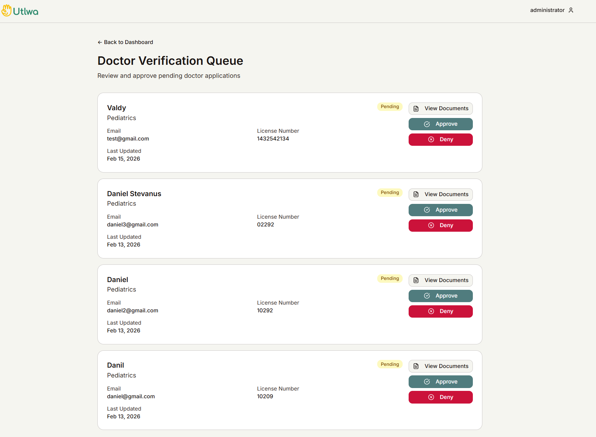

5. **SCRUM-26** — *As a system administrator, I would like to log in using my system administrator credentials…*
   To login as administrator, just click on the system administrator option.

   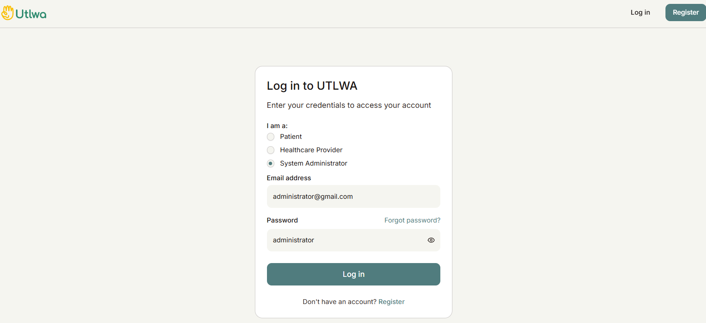

   After clicking on log in, there will be a dashboard of the system admin.

   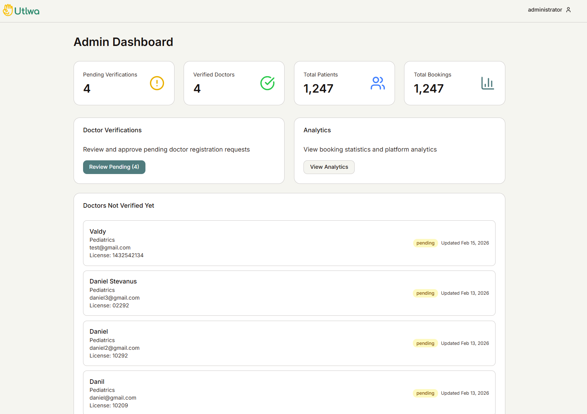

6. **SCRUM-20** — *As a doctor, I would like to set my availability (dates/times/types/durations)…*
   The doctor is able to set weekly recurring schedules like this:

   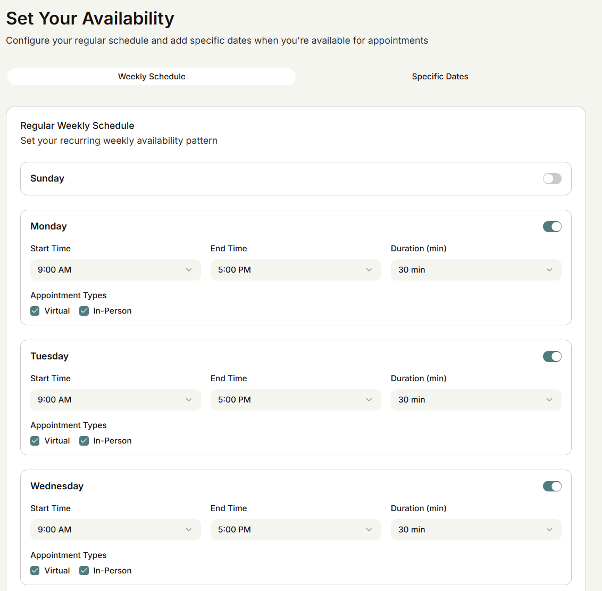

   They also have the option to set one off appointments like this:

   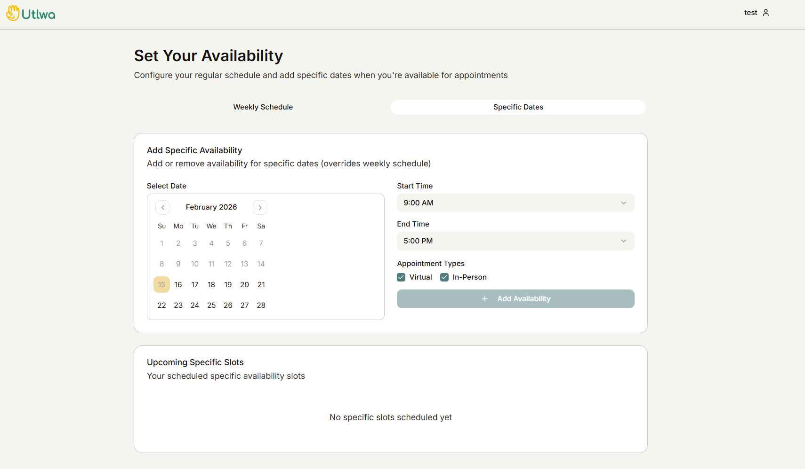

7. **SCRUM-4** — *As a user, I would like to access a single page with options to register or log in…*

   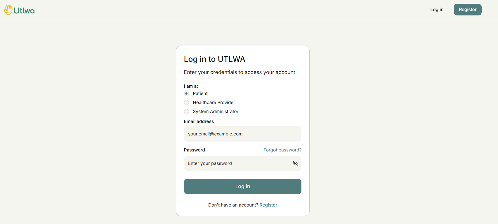

#### Goals and/or tasks that were planned but not met/completed:

The following user stories, we were not able to finish by the demo time as we didn’t have enough time. However, we were able to finish this all by the deadline of sprint 1.

1. **SCRUM-33** — *Password sent to backend in clear. Hash it in frontend* (security / release-blocker)

2. **SCRUM-9** — *Patient views list of doctors filtered by care type + availability*

3. **SCRUM-12** — *Patient views a doctor’s available time slots*

4. **SCRUM-8** — *Patient completes needs questionnaire + gets recommended care type*

5. **SCRUM-11** — *Patient views a doctor’s detailed profile*

6. **SCRUM-7** — *Patient views/edits their profile*

7. **SCRUM-19** — *Doctor views/edits their profile*

## Meeting Highlights

Going into the next iteration, our main insights are:

1. Learning Object-Relation Mapping
   Our TA told us to study ORM as from our current implementation of the project, it seems like we are doing a lot of things wrong such as the migration files. We will try to focus on learning the overall structure and how to effectively use the ORM first and then review our existing code to see which components are correct and which should be modified and then make the changes accordingly.

2. Understand the framework for the frontend
   The framework we are using is “vite”. Although we all know the basics of “vite”, we don’t fully understand it enough. This makes it difficult to tell if the code written by AI is fully correct or implemented in a manner that is efficient and follows good coding principles. Therefore, we will study “vite” in detail before making more changes to the frontend to reduce the amount of code that has to be reviewed. Then moving forward, we will always review the code written by the AI to see if what is doing is what we want and if it is implemented in the correct manner. This again was another feedback that was given by the TA during the demo.

3. Finish the Minimum Viable Product (MVP) of the website.
   This is more product related but during the next sprint, as we already have the project foundation setup, we will mainly focus on implementing the different features that were requested by the founder. We aim to be able to finish all the features requested by giving each member lots of features to work on. Some of these features include the actual booking of the appointments between patients and doctors and finding the nearest doctors available.