# Ultwa/the kindos

## Iteration 02 - Review & Retrospect

 * When: 5 February 2026 at 7:05 - 7:35 pm.
 * Where: Online

 ## Process - Reflection
 In this document, we will be doing a short reflection on how our second sprint went. This encompasses all the major good and bad decisions we made and our future plans for the next sprints. One thing to note is that some features were implemented after the demo and before the sprint 2 deadline. The features that we talk about will be the ones before the demo as we are expected to make this document right after the demo.

 #### Decisions that turned out well

List process-related (i.e. team organization) decisions that, in retrospect, turned out to be successful.

1. **Migration files of database**

During the first sprint, we decided to manage our PostgreSQL DB Schema using sequelize.sync(). This method automatically synchronizes the models we defined in our code with the database schema. We chose this approach because it was simple to implement and worked well during early testing. When we modified schemas or added tables, sync() successfully updated the database without deleting existing data, which made development convenient.

However, this decision was not good for a production-ready workflow. The sync() method does not maintain a versioned or auditable history of schema changes and its behavior can also vary depending on the existing database state or configuration, which can lead to unpredictable results. Because of this, it is not considered a safe or reliable approach for managing schema changes in production environments.

During our first demo, our TA pointed out this issue and recommended that we instead use proper migration files. Migration files allow schema changes to be explicitly defined, version-controlled, and applied safely without risking existing data.

In the second sprint, we addressed this by implementing migration files for our database schema updates. After making this change, our TA confirmed that this solution was appropriate and aligned with best practices for managing database schemas.

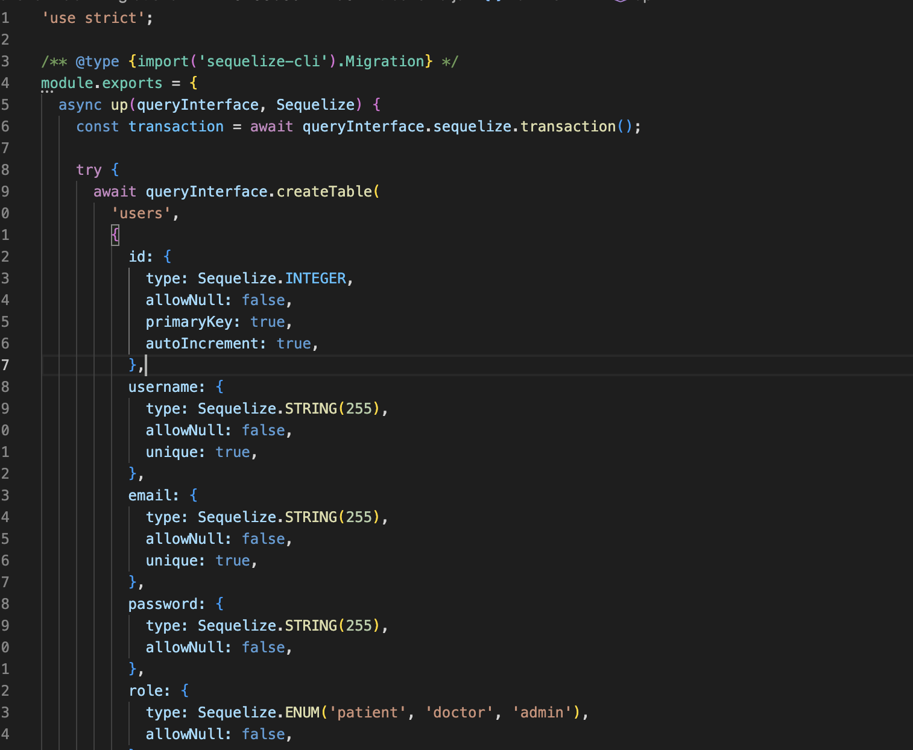

2. **Messaging System Using socket.io**

One decision that worked well for our system was implementing the messaging feature using Socket.IO, the site requires patients and doctors to communicate regarding appointments, so we wanted a messaging system that allowed near real-time communication instead of relying on slower request-response polling.

We chose Socket.IO because it enables persistent connections between the client and server using WebSockets when available, allowing messages to be sent and received instantly. This allowed our application to push new messages to users immediately without requiring them to refresh the page.

This decision worked well for our system. Messages were delivered quickly and consistently between patients and doctors, and the implementation integrated well with our existing backend built with Node.js and our frontend framework. The real-time communication also helped us meet our performance goal of message send/load response times under two seconds.

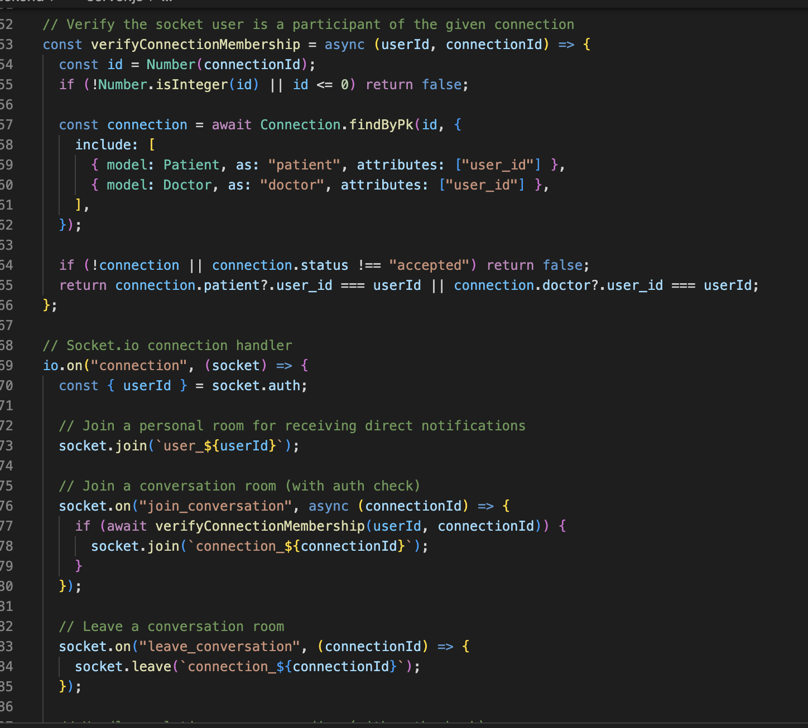

#### Decisions that did not turn out as well as we hoped

List process-related (i.e. team organization) decisions that, in retrospect, were not as successful as you thought thyaey would be.

1. **User Information Stored in Local Storage**

During development, our team decided to store certain user information such as the user ID and email in the browser’s local storage. This decision was made because it simplified accessing user data across different parts of the frontend without repeatedly requesting it from the backend. It also made it easier to maintain the user’s logged-in state during development.

However, in retrospect this approach introduced potential security concerns. Storing sensitive or identifiable user information in local storage can expose it to client-side scripts and makes it more vulnerable in the event of cross-site scripting (XSS) attacks. During our demo, our TA pointed out that relying on local storage for this type of data is not considered best practice for secure web applications.

Because of this feedback, we recognized that a more secure approach would be to rely on server-side session management or secure authentication tokens rather than storing user information directly in the browser. This experience highlighted the importance of considering security implications earlier in the design process rather than focusing only on development convenience.

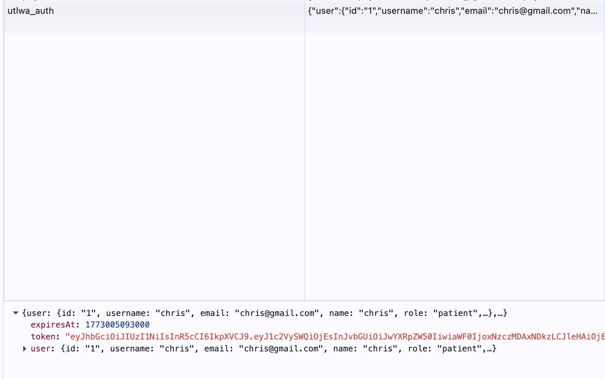

#### Planned changes

List any process-related changes you are planning to make (if there are any)

 * Ordered from most to least important.
 * Explain why you are making a change.

1. **User Information Stored in Local Storage**
    We plan to remove sensitive user information from local storage and instead rely on more secure methods such as server-side authentication checks or secure tokens to manage user sessions. This change will help ensure that sensitive user data is not unnecessarily exposed on the client side and will align our implementation with better security practices for web applications

## Product - Review

#### Goals and/or tasks that were met/completed:
Note that these goals / tasks were the tasks that were finished before the demo (5th March) and not the deadline of sprint 2 (8th March).
 * From most to least important.
 * Refer/link to artifact(s) that show that a goal/task was met/completed.
 * If a goal/task was not part of the original iteration plan, please mention it.

1. **SCRUM-25** — *As a doctor, I would like to write a summary for each patient appointment…*
    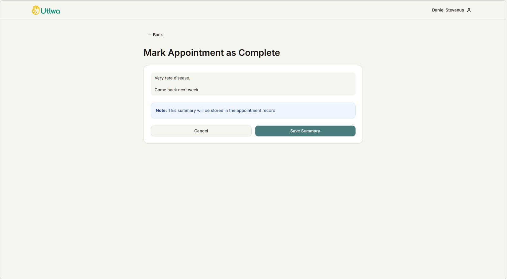
    
2. **SCRUM-24** — *As a doctor, I would like to view a patient’s appointment history + past summaries…*
    Doctor can view a patient's past history to get more information about them before choosing to accept or deny appointment.
    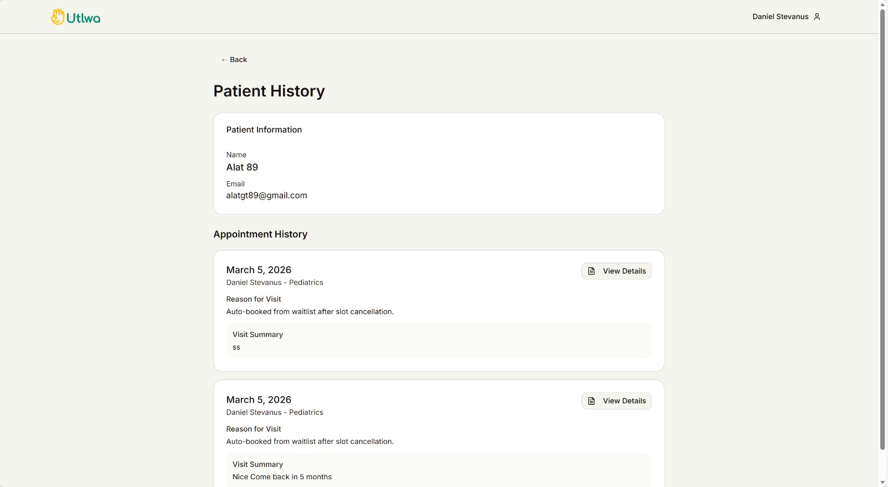

3. **SCRUM-17** - *As a patient, I would like to join a waitlist and receive notifications when appointments are cancelled...*
    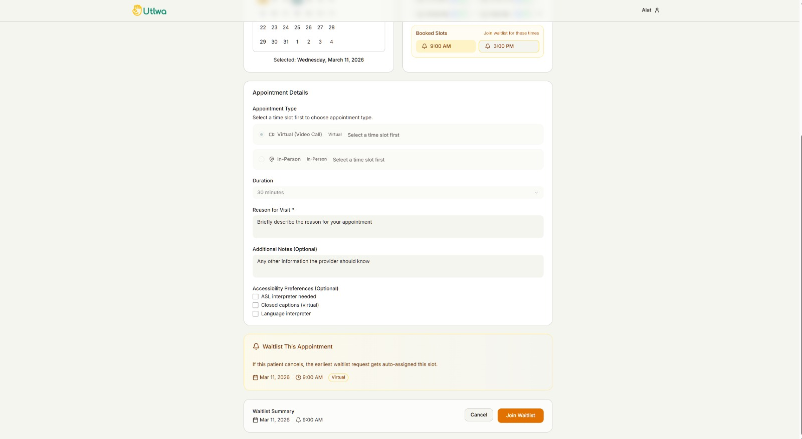

4. **SCRUM-14** — *As a patient, I would like to see my upcoming and past appointments and manage them (view/reschedule/cancel)…*
    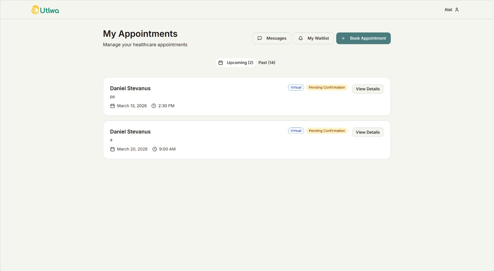

    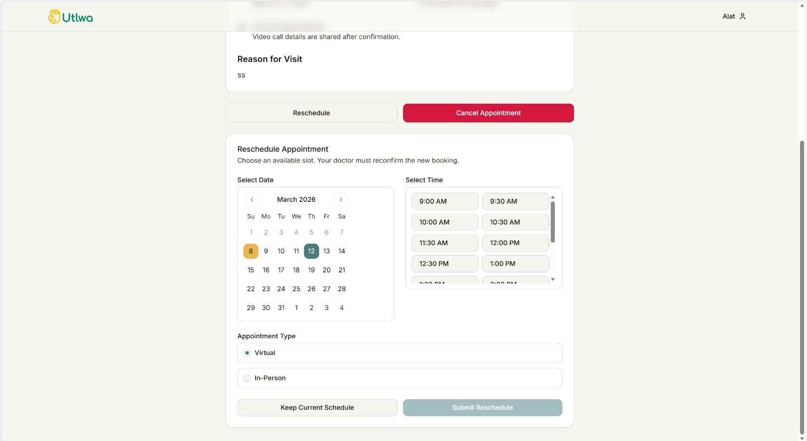

5. **SCRUM-13** — *As a patient, I would like to book an appointment (virtual/in-person) and receive confirmation/reminders email…*
    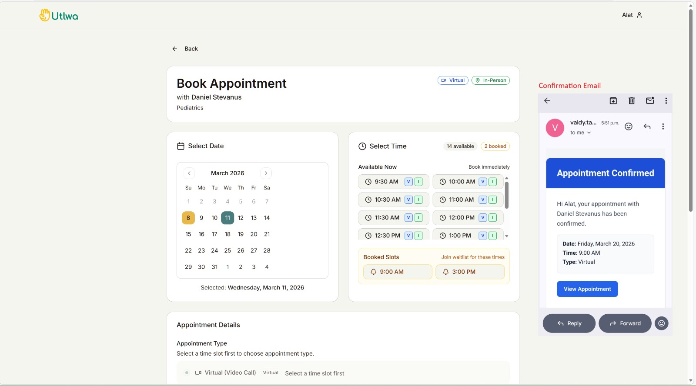

6. **SCRUM-21** — *As a doctor, I would like to view my schedule (upcoming/past) and patient details for each appointment…*
    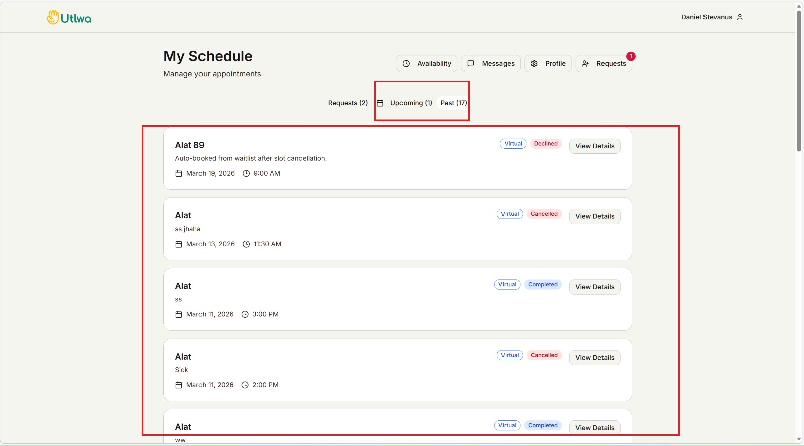

7. **SCRUM-10** — *As a patient, I would like to view and choose available doctors on a map…*
    On the last stage of the user needs questionnaire, it shows doctors fitting requirements on a map.

    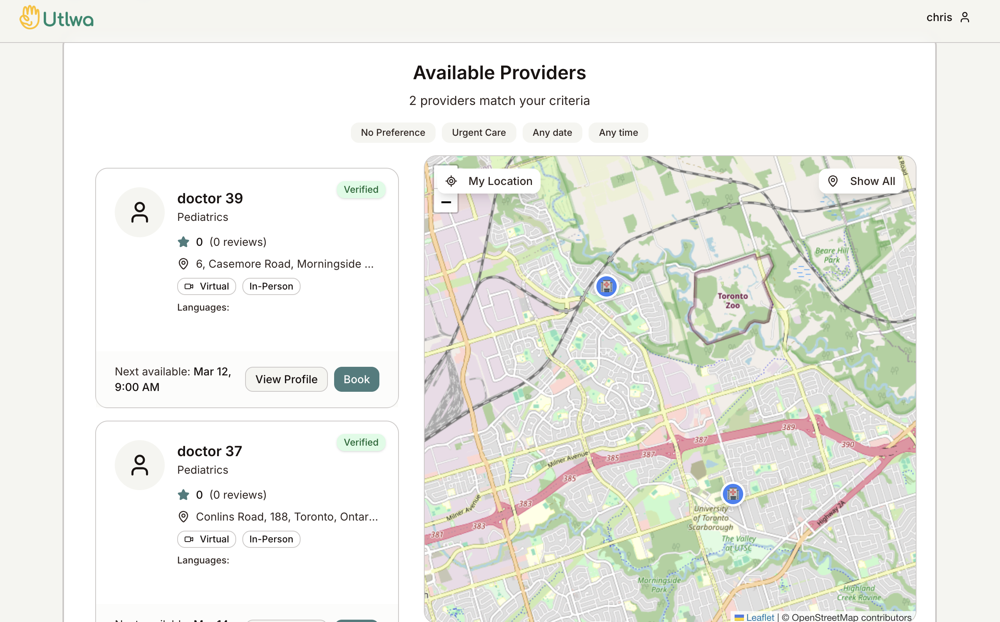

8. **SCRUM-15** — *As a patient, I would like to connect with and message a doctor to ask questions…*
    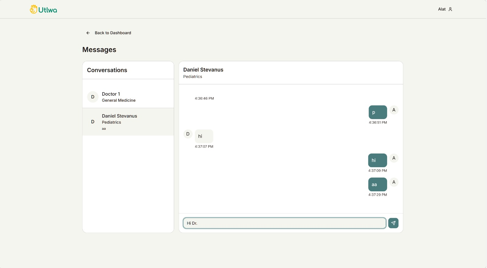

9. **SCRUM-23** — *As a doctor, I would like to connect with and chat with patients…*
    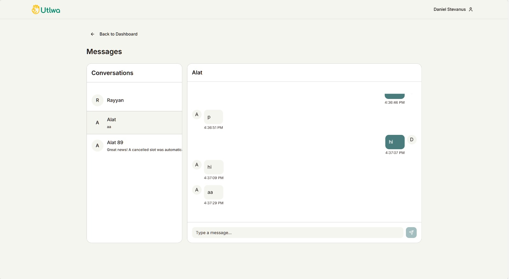

10. **SCRUM-34** — *As a doctor, I would like to choose my clinic address on a map…*
    Doctor can set their address on their profile page on Dashboard.

    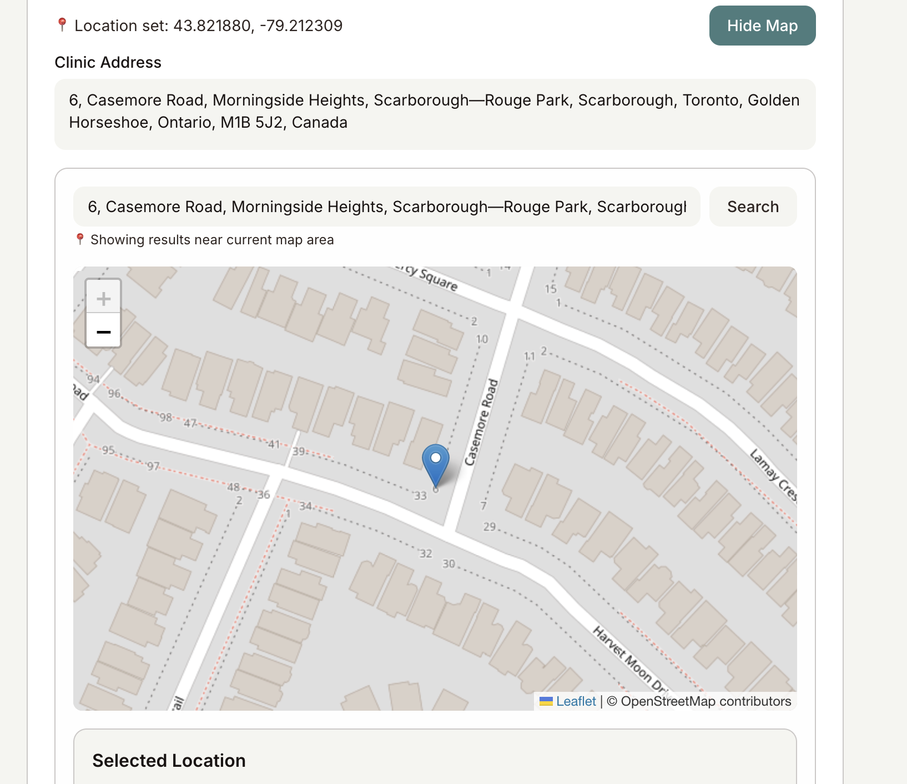

11. **SCRUM-36** — *Doctors should be able to set their availability on intervals of time with fixed duration…*

    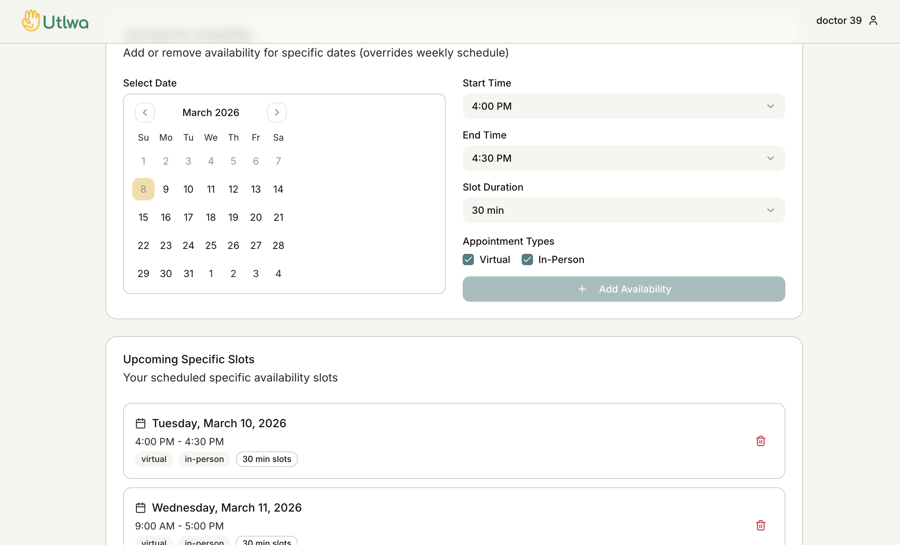

#### Goals and/or tasks that were planned but not met/completed:

The following user stories, we were not able to finish by the demo time as we didn’t have enough time. However, we were able to finish this all by the deadline of sprint 2.

1. **SCRUM-22** — *As a doctor, I would like to reschedule or cancel appointments…*

2. **SCRUM-16** — *As a patient, I would like to rate and review a doctor after an appointment…*

## Meeting Highlights

Going into the next iteration, our main insights are:

1. Addressing the security issue where some user credentials and identifying information were stored in the browser’s local storage. While this approach made development easier, it creates potential security risks because local storage can be accessed by client-side scripts, which could expose sensitive information if a vulnerability such as cross-site scripting occurs.

To improve security, we plan to move away from storing sensitive user data in local storage and instead use secure cookies to manage user authentication and sessions. Cookies can be configured with security flags such as HTTP-only and secure attributes so that they cannot be accessed directly by JavaScript and are transmitted safely between the client and server.

2. We still will utilize local storage for non-sensitive user preferences. For example, when a patient selects preferences such as “any date” or “any time” while searching for appointments, these preferences could be stored locally so that the user does not need to repeatedly configure them each time they book an appointment. We can also implement this for pagination for past appointments, patients viewing doctors, etc. 