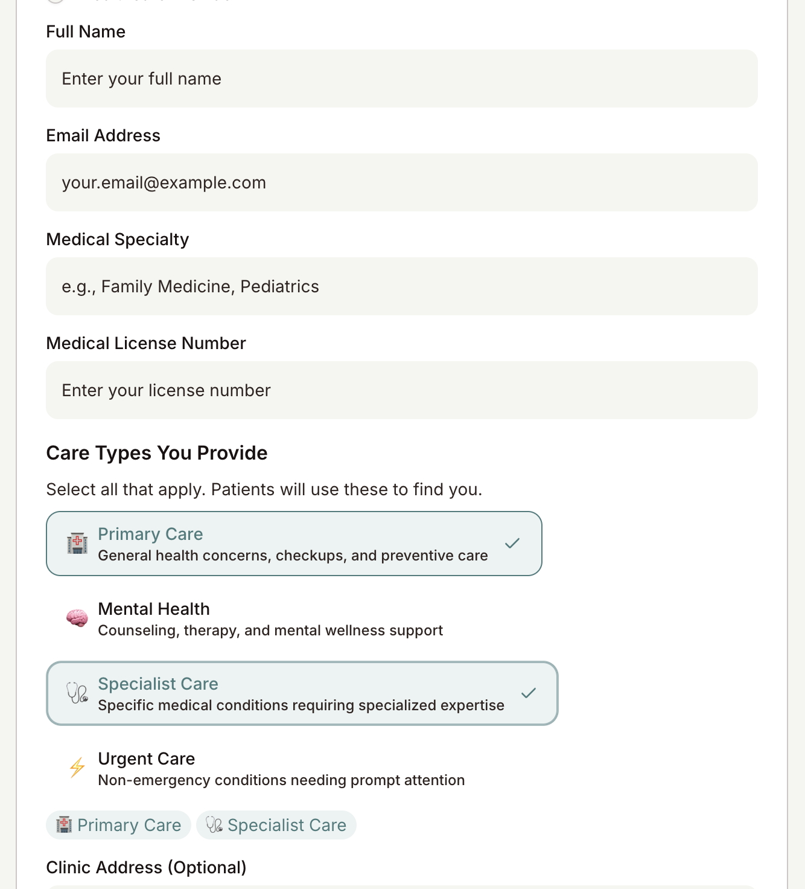
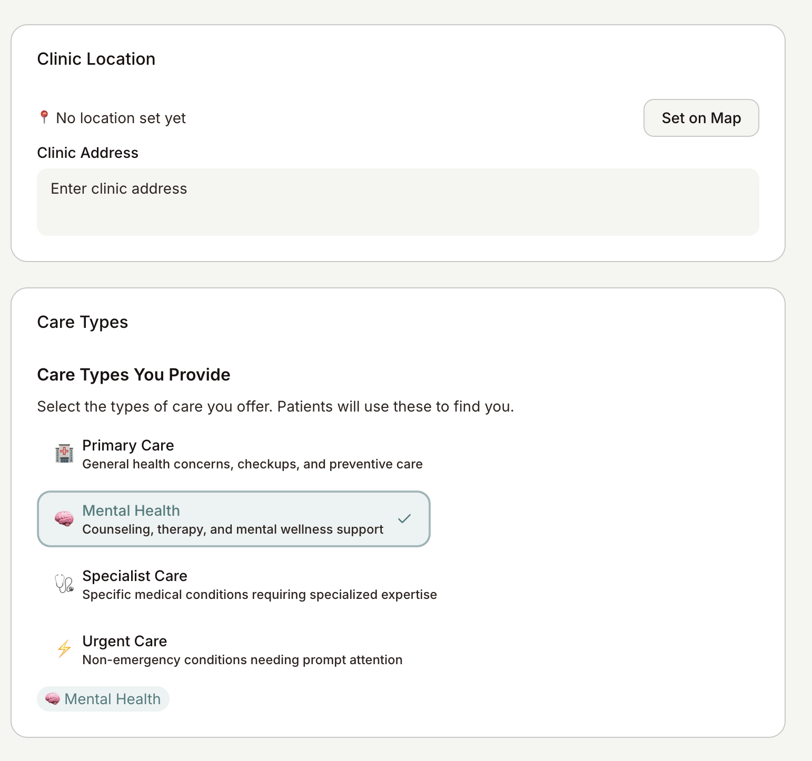
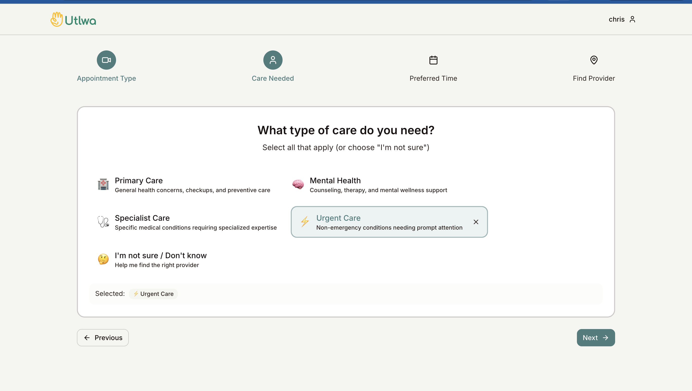
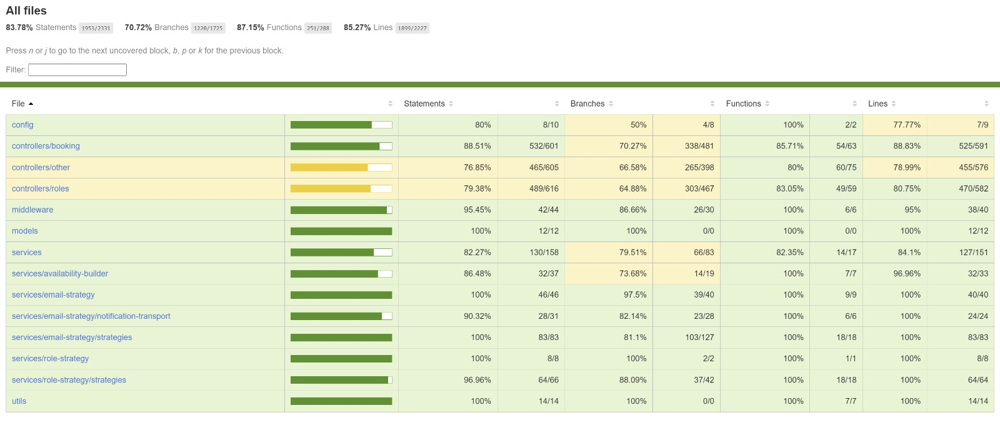
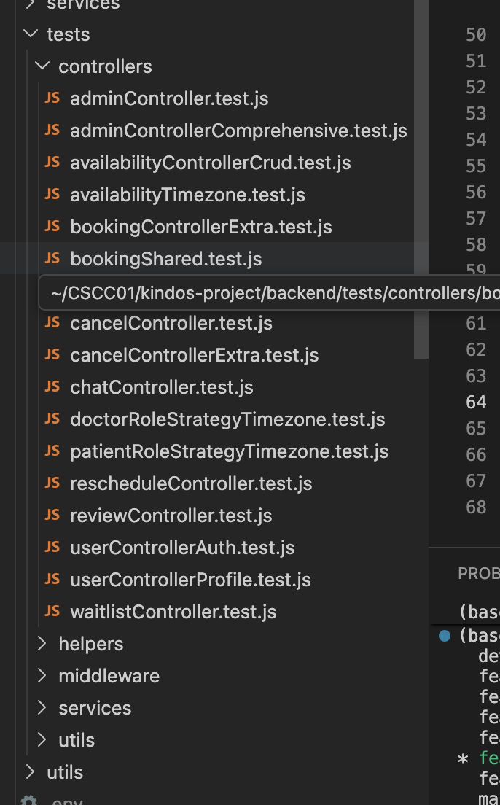
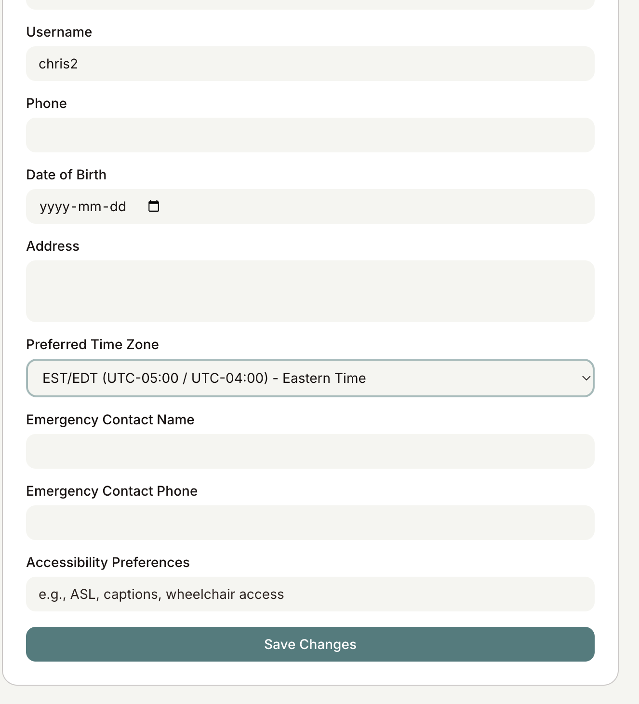
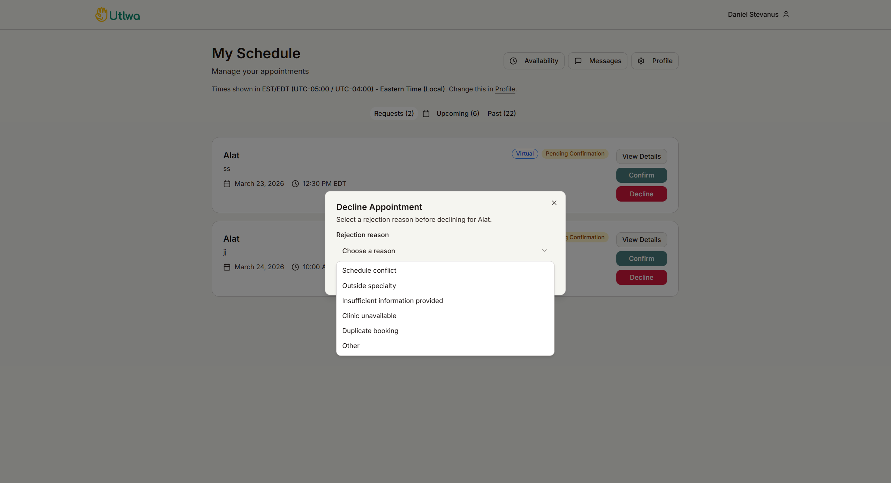
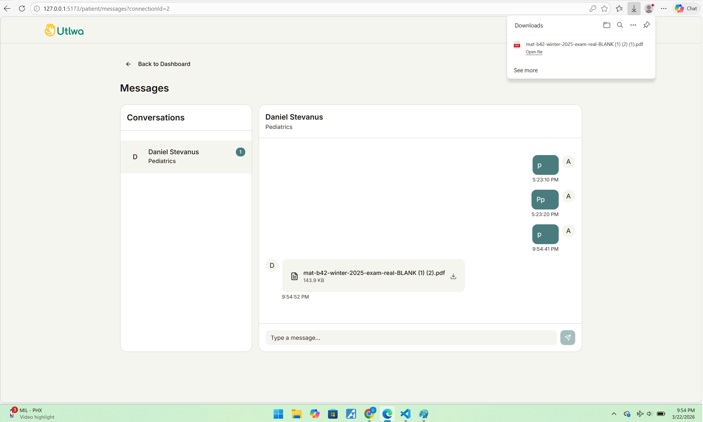
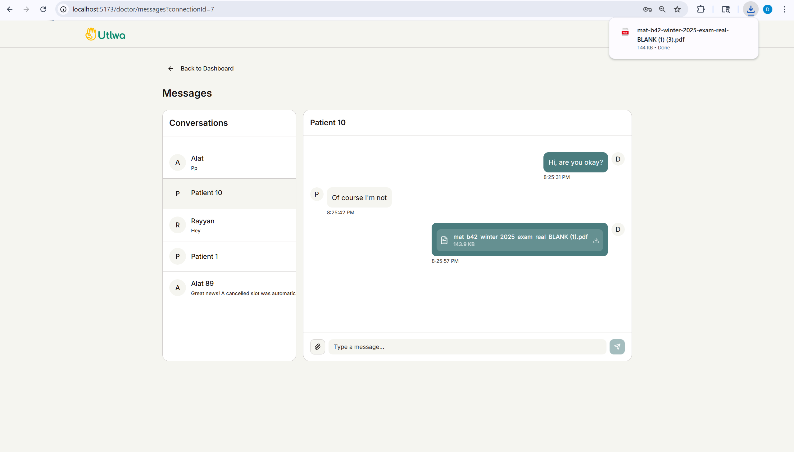

# Ultwa/the kindos

## Iteration 02 - Review & Retrospect

 * When: 20 March 2026 at 8:00 - 8:30pm.
 * Where: Online

 ## Process - Reflection
 In this document, we will be doing a short reflection on how our third sprint went. This encompasses all the major good and bad decisions we made and our future plans for the next sprints. One thing to note is that some features were implemented after the demo and before the sprint 3 deadline. The features that we talk about will be the ones before the demo as we are expected to make this document right after the demo.

 #### Decisions that turned out well

List process-related (i.e. team organization) decisions that, in retrospect, turned out to be successful.

1. **Using Local Storage to Store User Preferences for Questionnaire**

We strategically chose to use localStorage to store non-sensitive patient questionnaire preferences such as appointment type and care needs. This decision proved successful because it provided a seamless user experience by allowing patients to skip re-entering their preferences on subsequent visits. By storing only non-sensitive data (appointment type, care type, preferred date/time options) rather than personal identifiable information, we maintained a good balance between convenience and security. 

This approach also reduced server load by eliminating unnecessary API calls to fetch saved preferences, improved performance with instant load times, and worked offline - making the booking process faster and more user-friendly. The simplicity of implementation also allowed us to deliver this feature quickly while reserving secure cookie-based storage for authentication tokens and sensitive user data.

#### Decisions that did not turn out as well as we hoped

List process-related (i.e. team organization) decisions that, in retrospect, were not as successful as you thought thyaey would be.

1. **Calendly for Appointment Dates and Scheduling**

Due to an idea suggested to us by our founder, we decided to look into using Caldendly to handle appointment scheduling and date management. However we started looking into this potential after we had already implemented the relevant features. This is because we were under the impression that Calendly would work similar to Google Calendar and could be easily integrated. 

In reality, integrating Calendly would have required significant refactoring of our existing appointment system, including database schema changes and reworking how availability slots are managed. Since we had already invested substantial time in building our own scheduling system, we decided to stick with our custom implementation rather than pivoting to a third-party service. This taught us to evaluate third-party integrations earlier in the development process before committing to custom implementations.

#### Planned changes

List any process-related changes you are planning to make (if there are any)

 * Ordered from most to least important.
 * Explain why you are making a change.

N/A: We're mostly done with features and for sprint 4, we will mainly work on trying to implement GitHub Actions CI/CD Pipleline, and some features the founder requested that we try if we have time
  

## Product - Review

#### Goals and/or tasks that were met/completed:
Note that these goals / tasks were the tasks that were finished before the demo (5th March) and not the deadline of sprint 3 (20th March).
 * From most to least important.
 * Refer/link to artifact(s) that show that a goal/task was met/completed.
 * If a goal/task was not part of the original iteration plan, please mention it.

1. **SCRUM-47** — *As a doctor, I would like to select the specific types of care I provide from a dropdown during registration...*
    While registering, a doctor can choose their selected care type
    

    A doctor can also later change their selected care type in their profile page
    
    
2. **SCRUM-48** — *As a patient, I would like to select the type of care I need or "Don't know" from a dropdown…*
    A patient can select the care type they need while on the questionnaire page
    

3. **SCRUM-38** — *As a developer, I want to set up a unit testing framework so that I can reliably test…*
    

4. **SCRUM-39** — *As a developer, I want to add unit tests for critical features…*
    

5. **SCRUM-51** - *Doctor info is stored in clear in local storage…*

6. **SCRUM-40** - *As a patient, I would like to see my appointment time in my local time zone…*
    

7. **SCRUM-46** - *As a system administrator, I would like doctors to select a rejection reason from a dropdown…*
    

8. **SCRUM-42** - *As a patient, I would like to receive documents from my doctor through…*
    

9. **SCRUM-43** - *As a doctor, I would like to send documents to patients…*
    

10. **SCRUM-49** - *Only doctor can initiate message…*
    

11. **SCRUM-41** - *As a doctor, I would like to see my appointment time in my local time zone…*
    

#### Goals and/or tasks that were planned but not met/completed:

The following user stories, we were not able to finish by the demo time as we didn’t have enough time. However, we were able to finish this all by the deadline of sprint 2.

1. **SCRUM-50** — *Instead of having to answer questionnaire multiple times on booking, store the info in the database…*

## Meeting Highlights

Going into the next iteration, our main insights are:

1. **Set Up GitHub Actions CI/CD Pipeline** 

    We will configure GitHub Actions to automatically build, test, and deploy our application whenever code is pushed to the main branch. The pipeline will include:

    Automated builds of Docker images for both frontend and backend

    Log monitoring for the backend to capture errors and performance metrics

    Manual deployment triggers to give us control over when changes go to production

    Frontend QA checks to validate code quality and catch regressions before deployment

    This automation will reduce manual deployment overhead, catch issues earlier in the development cycle, and provide visibility into our application's health through logs and monitoring.