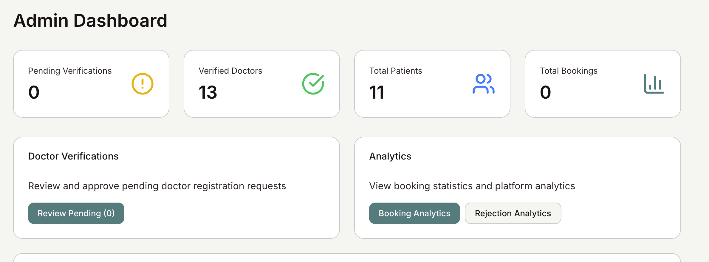
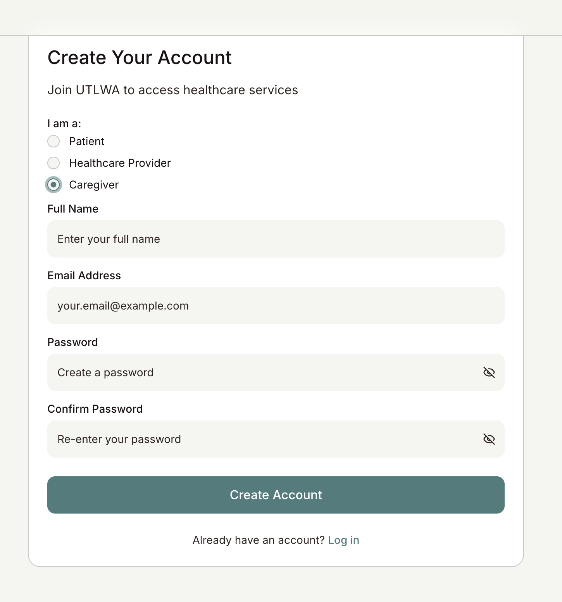
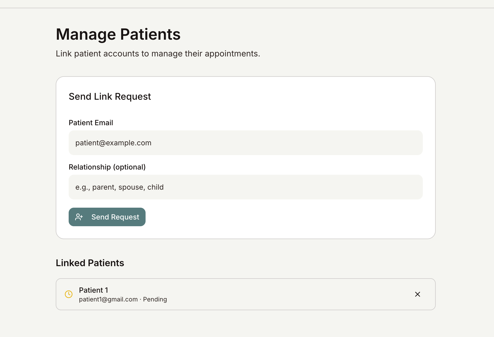
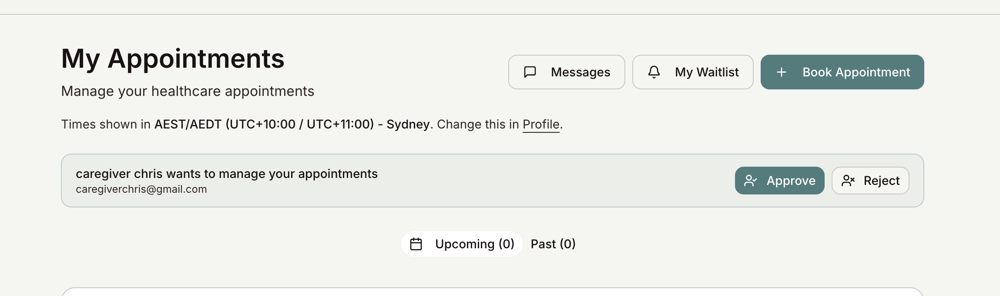
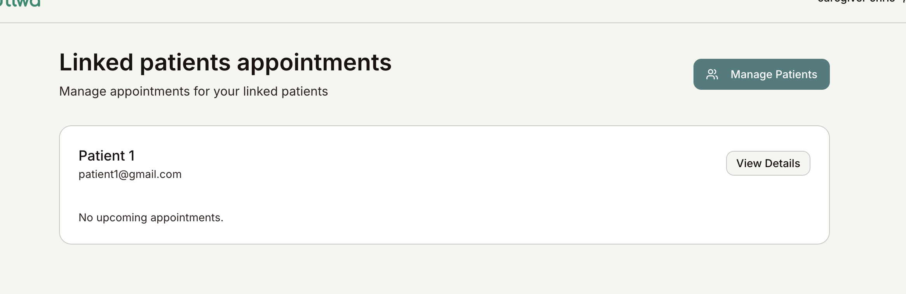

# Ultwa/the kindos

## Iteration 02 - Review & Retrospect

 * When: 7 April 2026 at 8:00 - 8:30pm.
 * Where: Online

 ## Process - Reflection
 In this document, we will be doing a short reflection on how our third sprint went. This encompasses all the major good and bad decisions we made and our future plans for the next sprints. One thing to note is that some features were implemented after the demo and before the sprint 4 deadline. The features that we talk about will be the ones before the demo as we are expected to make this document right after the demo.

 #### Decisions that turned out well

List process-related (i.e. team organization) decisions that, in retrospect, turned out to be successful.

1. **Implementing an End-to-End Validated CI/CD Pipeline with Parallel Jobs and Caching**

    We chose to implement a CI/CD pipeline through GitHub Actions that runs linting, unit tests, security scans, and Docker builds automatically when a pull requests or pushes to main happens. This was successful because it caught code quality issues and regressions before merge, prevented insecure dependencies from reaching production through vulnerability scans on main branch pushes, and ensured consistent deployable artifacts by building and pushing Docker images with the latest tag. 

    By running jobs independently in parallel with caching, we followed industry practices and kept pipeline times efficient. This approach also reduced manual errors by eliminating the need for developers to remember to run linters, tests, or security checks locally. The clear separation of triggers (PRs for validation, main pushes for deployment) guaranteed that only properly validated code would reach production, while the automated end-to-end validation prevented last-minute integration failures before submission deadlines.

#### Decisions that did not turn out as well as we hoped

List process-related (i.e. team organization) decisions that, in retrospect, were not as successful as you thought thyaey would be.

#### Planned changes

List any process-related changes you are planning to make (if there are any)

 * Ordered from most to least important.
 * Explain why you are making a change.

N/A: As this is the last sprint, and we have completed the features the founder has asked for, and CI/CD suggested by our TA, there is no more features left to develop.

## Product - Review

#### Goals and/or tasks that were met/completed:
Note that these goals / tasks were the tasks that were finished before the demo (5th March) and not the deadline of sprint 4 (7th April).
 * From most to least important.
 * Refer/link to artifact(s) that show that a goal/task was met/completed.
 * If a goal/task was not part of the original iteration plan, please mention it.

1. **SCRUM-28** — *As a system administrator, I would like to view booking analytics…*

    Admin can view analytics + booking/rejection analytics
    

2. **SCRUM-64** — *As a caregiver, I would like to manage multiple patient profiles…*

    Caregiver can log in/create a new account
    

    Caregiver can request to link with a patient
    

    Patient can accept or deny a request from a caregiver
    

    Caregiver can view linked patients' appointments
    

3. **CI/CD Pipleline** - *Linting, unit tests, vulnerability scanning, and Docker image builds automated via GitHub Actions on PRs and main pushes*

#### Goals and/or tasks that were planned but not met/completed:

The following user stories, we were not able to finish by the demo time as we didn’t have enough time. However, we were able to finish this all by the deadline of sprint 4.

N/A

## Meeting Highlights

Going into the next iteration, our main insights are:

N/A. As this is the last sprint there isn't much to do, and since the deliverables are due before our demo meeting with the TA, there isn't insight we can use to improve our product.